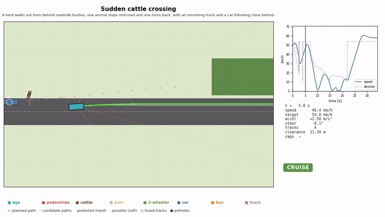
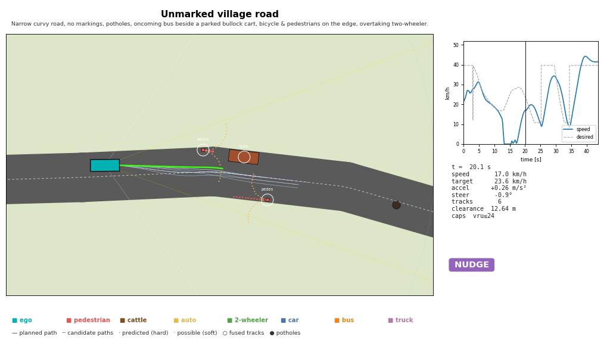
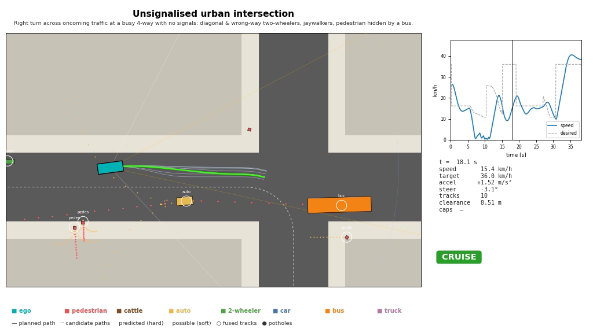
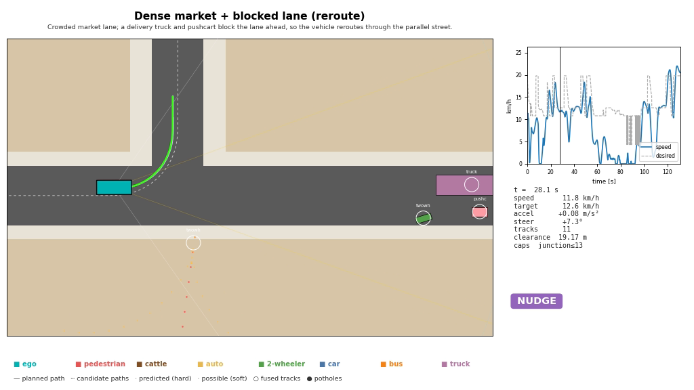
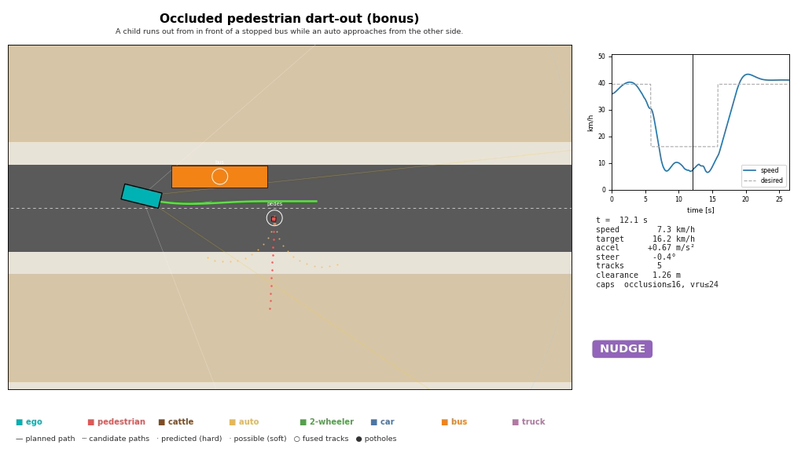

# UGV-AV:Adaptive Path Planning & Collision Avoidance on Unstructured Indian Roads


-orange)


A complete closed-loop autonomous-driving stack for roads **without lane discipline**:
mixed traffic of cars, buses, auto-rickshaws, two-wheelers, pushcarts, pedestrians and
cattle; missing lane markings; potholes; informal merging; and hazards hidden behind
parked vehicles. It was built for the Smart India Hackathon 2026 problem statement
*"Adaptive Path Planning and Collision Avoidance for Autonomous Vehicles on Unstructured
Indian Roads"*.

<p align="center"></p>

**Perception → fusion → prediction → decision logic → rerouting → lane-free planning →
control**, validated on 6 Indian road scenarios with randomised Monte-Carlo runs. It runs
in a pure-Python simulator in seconds, and as a 3D digital twin in **Gazebo Sim 8 +
ROS 2**.

---

## Results

**47/48 runs completed, 0 collisions**: 6 scenarios × 8 randomised seeds, closed loop in the Python simulator.

| Scenario | Completed | Collisions | Avg speed | Min clearance | Replan mean / p95 | Reaction | RMS jerk long / lat (m/s³) | Peak decel |
|---|---|---|---|---|---|---|---|---|
| S1 Village road | 7/8 | 0 | 18.9 km/h | 0.29 m | 29 / 70 ms | 0.17 s | 3.38 / 2.02 | 8.0 m/s² |
| S2 Urban junction | 8/8 | 0 | 16.8 km/h | 0.75 m | 60 / 196 ms | 0.22 s | 2.84 / 1.14 | 4.5 m/s² |
| S3 Highway merge | 8/8 | 0 | 53.4 km/h | 0.18 m | 51 / 103 ms | 0.20 s | 5.17 / 5.20 | 8.0 m/s² |
| S4 Market + reroute | 8/8 | 0 | 8.4 km/h | 0.08 m | 20 / 64 ms | 0.20 s | 2.86 / 0.79 | 6.7 m/s² |
| S5 Cattle crossing | 8/8 | 0 | 30.1 km/h | 1.22 m | 36 / 87 ms | 0.19 s | 3.36 / 1.70 | 7.0 m/s² |
| S6 Dart-out | 8/8 | 0 | 26.1 km/h | 0.61 m | 27 / 74 ms | 0.18 s | 2.24 / 1.31 | 4.9 m/s² |

- **Replan latency** is planner compute time per cycle, measured in Python/NumPy on a 2-core cloud VM.
- **Reaction** is the time from first detection, through track confirmation, to a new plan.
- **Market**: the car rerouted in all 8 runs.
- **The failed run** is village seed 6, which timed out. The car stopped behind the parked bullock cart. The cart hides the oncoming half of the road, so the no-blind-overtake rule never let the car pull out. It waited safely but did not finish.
- **Close passes to look at in the videos**: 0.08 m in one market run, where pedestrians moved around a stopped or creeping car, and 0.18 m on the highway.

<p align="center"></p>

### Gallery

| Village road (S1) | Urban junction (S2) |
|---|---|
|  |  |
| **Market reroute (S4)** | **Dart-out (S6)** |
|  |  |

Each frame shows:
- fused tracks (white circles with class labels);
- hard predictions (red dots) and soft predictions (orange);
- candidate paths (pale) and the chosen path (green);
- the decision state and speed trace, in the side panel.

## Scenarios

| ID | Scenario | What makes it hard |
|---|---|---|
| S1 | Unmarked village road | No markings; potholes; an oncoming bus beside a parked bullock cart; a bicycle and a pedestrian on the edge |
| S2 | Busy unsignalised junction | Right turn across oncoming traffic; wrong-way and diagonal two-wheelers; a pedestrian hidden by a stopped bus |
| S3 | Highway merge | A slow tractor and truck; a bus merging without signalling; a wrong-way rider on the shoulder; a pedestrian crossing |
| S4 | Dense market + blocked lane | Wandering crowds and cows. A delivery truck and pushcart block the lane, so the car **reroutes** through a parallel street |
| S5 | Sudden cattle crossing | A herd comes out from behind bushes; one animal stops mid-road and one turns back |
| S6 | Occluded dart-out | A child runs out from in front of a parked bus |

Each run randomises agent speeds, trigger distances, positions and sensor noise, so the
metrics are rates rather than one hand-tuned pass.

## How it works

```
 World (20 Hz) ──► Sensors (10 Hz): camera 80 m · LiDAR 50 m · radar 120 m, ray-traced occlusion
                      └─► EKF multi-object tracker (Hungarian association, class & size fusion)
                             └─► Multi-modal prediction: constant-velocity (hard) + stop / swerve / dart (soft)
                                    └─► Decision FSM + A* router (blocked-road detection)
                                           └─► Frenet lattice planner over the FULL road width
                                                  └─► Pure-pursuit + PI control ──► kinematic bicycle / Gazebo car
```

| Module | File | What it does |
|---|---|---|
| World & agents | `av/world.py` | Road graph; 11 road-user classes with Indian behaviours (lateral wander, informal merges, wrong-way riding, bypassing stopped vehicles, darting pedestrians, cattle that pause or turn back) |
| Sensors | `av/sensors.py` | Camera (class, range-dependent noise), LiDAR (position, size, heading), radar (radial velocity; weak on pedestrians and animals), occlusion ray-tracing |
| Fusion | `av/tracker.py` | Constant-velocity EKF, sequential per-sensor global-nearest-neighbour association, M-of-N confirmation, radar radial-velocity update |
| Prediction | `av/prediction.py` | Class-specific uncertainty growth; traffic predicted to queue behind stopped vehicles rather than pass through them |
| Decision | `av/behavior.py` | CRUISE / FOLLOW / NUDGE / YIELD / OCCLUSION_CAUTION / WAIT / EMERGENCY / REROUTE, plus situational speed caps |
| Routing | `av/router.py` | Finds cross-sections with no gap wide enough for the car, closes that road segment, and runs A* from the last usable junction |
| Planner | `av/planner.py` | About 500–1,100 candidate paths × speed profiles each cycle, collision checks against predictions, rejection of blind overtakes, minimum-risk fallback |
| Control | `av/vehicle.py` | Pure pursuit + feed-forward/PI speed control; bicycle model with actuator limits |
| Stack | `av/stack.py` | The whole pipeline as one reusable object, used by the Python simulator and the ROS 2 node |

**Indian-road rules built in:**
- no lanes: lateral positions are sampled every 0.5 m across the whole drivable width;
- keep left;
- creep through unsignalised junctions;
- 16 km/h when passing a stopped bus or truck that could hide a pedestrian;
- never overtake into an oncoming half of the road you cannot see;
- never stop inside an oncoming vehicle's path, which avoids head-on standoffs;
- "honk and creep" after long waits behind loitering people or animals.

**Real-time replanning:**
- plans are made every 200 ms, and immediately when a new object is confirmed or fresh
  predictions make the current plan unsafe;
- each plan starts from the previous plan's state, which keeps paths smooth.

The full design is in [docs/REPORT.md](docs/REPORT.md), and there is an interactive
blueprint in [docs/blueprint.html](docs/blueprint.html).

## Quick start: Python simulator (any OS, no ROS needed)

```bash
git clone https://github.com/OWNER/bharat-av.git && cd bharat-av
python3 -m venv .venv && source .venv/bin/activate
pip install -r requirements.txt
sudo apt install ffmpeg                         # for the videos (Ubuntu)

python3 run_all.py --only S5 --seeds 1          # one scenario + video, about 30 s
python3 run_all.py                              # all 6 scenarios x 5 seeds, metrics + videos
python -m pytest -q                             # smoke tests
```

Outputs go to `results/`:
- `metrics_summary.csv`
- `summary_dashboard.png`
- `videos/<scenario>.mp4`: bird's-eye view with tracks, predictions, candidate and
  chosen paths, decision state and speed trace
- `demo_all_scenarios.mp4`

## Gazebo Sim 8 + ROS 2 digital twin

`ros2_ws/src/bharat_sim` generates a 3D Gazebo world for any scenario. The world
contains:
- unmarked roads, potholes, and buildings or bushes that really block the view;
- every road user, as its own model;
- a 4-wheel **Ackermann** car with a camera, 3D LiDAR and IMU.

Two ROS 2 nodes run the scenario:
- **`traffic_manager`** drives the road users with the same behaviours as the Python
  scenarios;
- **`autonomy`** runs the full stack and drives the car through `ros_gz_bridge`.

```bash
# Ubuntu 24.04 + ROS 2 Jazzy + Gazebo Sim 8 (Harmonic)
sudo apt install ros-jazzy-ros-gz ros-jazzy-rviz2 python3-scipy
cd ros2_ws && colcon build --symlink-install && source install/setup.bash
ros2 launch bharat_sim sim.launch.py scenario:=S5
```

The step-by-step guide, including a Gazebo-only check and troubleshooting, is in
[ros2_ws/src/bharat_sim/README.md](ros2_ws/src/bharat_sim/README.md).

`test_offline.py` rehearses the exact node logic against a stand-in for Gazebo's
Ackermann car, so the ROS logic is tested in CI without Gazebo.

## MATLAB / RoadRunner bridge

```bash
python3 export_matlab.py        # -> matlab/data/<scenario>/{road.json, actors.csv, ego.csv}
```

In MATLAB, `replay_scenario("S2_junction")` rebuilds any run in `drivingScenario`, for
Driving Scenario Designer or RoadRunner. This script has not been tested in MATLAB yet.

## Repository layout

```
av/                     core library (world, sensors, tracker, prediction, behavior,
                        router, planner, vehicle, stack, sim, scenarios, viz)
run_all.py              Monte-Carlo runner: metrics, charts, videos
export_matlab.py        CSV/JSON export for MATLAB / RoadRunner
matlab/                 replay_scenario.m + exported data
ros2_ws/src/bharat_sim  ROS 2 package: world generator, traffic_manager, autonomy, launch, RViz
tests/                  pytest smoke tests
tools/sync_av.sh        keep the ROS package's copy of av/ in sync
docs/                   technical report, blueprint, media
```

## Known limitations

- Perception in both simulators is a **sensor model** (ground truth plus noise,
  detection probability and occlusion), not detection from images. Detecting from the
  Gazebo camera and LiDAR topics (YOLO trained on the IDD dataset, LiDAR clustering) is
  the next step.
- Other road users are rule-based and mostly do not react to the car.
- The car cannot reverse or U-turn. If it spots a blockage after the last junction it
  could turn at, it waits.
- The planner takes 20–60 ms per cycle in Python/NumPy. The busiest junction has a p95
  of about 200 ms, which is at the 200 ms cycle budget.
- The no-blind-overtake rule can be too strict. If a parked vehicle hides the oncoming
  half of the road, the car may wait behind it indefinitely (1 of 48 runs). A fix is to
  creep out gradually to look past it, as human drivers do.
- The Gazebo package's logic is tested against the offline Ackermann stand-in. It has not
  been run in a Gazebo session in CI. In that rehearsal, one market run (S4, seed 1) times
  out without a collision.

## Acknowledgements

Built for Smart India Hackathon 2026. The problem statement recommends MathWorks tools;
this repository is an open-source Python/ROS 2 implementation with a MATLAB export bridge.

## License

[MIT](LICENSE)
