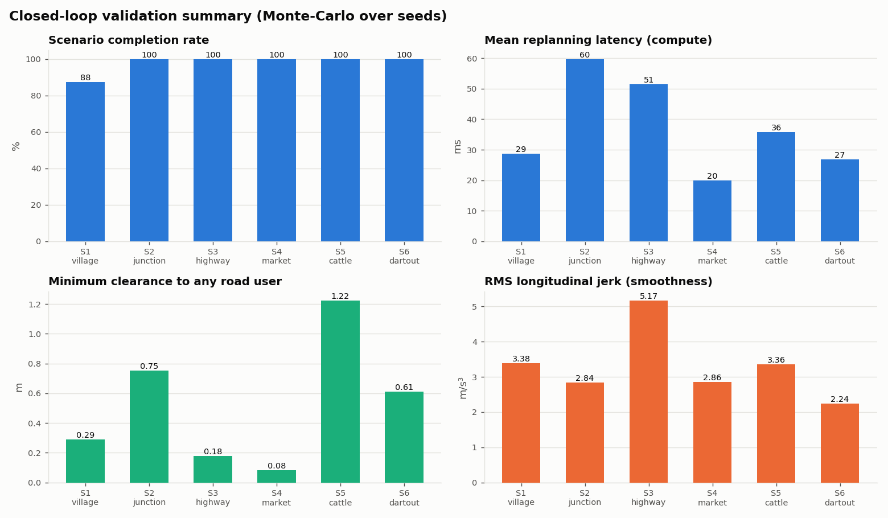

# Adaptive Path Planning and Collision Avoidance for Autonomous Vehicles on Unstructured Indian Roads
### Technical report

## 1. Problem

Indian roads break the assumptions most autonomous-driving stacks are built on. Lane
markings are often missing. Road edges are blurred by shoulders and encroachment.
Cars, buses, trucks, auto-rickshaws, two-wheelers, bicycles, pushcarts, pedestrians and
animals share the same surface and move without lane discipline. Merging is informal,
wrong-way riding and jaywalking are common, and hazards appear from behind parked
vehicles, bushes and buildings.

We built a closed-loop system that:

* perceives the scene with camera, LiDAR and radar;
* tracks and predicts non-lane-based motion;
* plans a collision-free path that uses the whole drivable width;
* replans in real time;
* reroutes when the road ahead is blocked.

It is validated on six scenarios with Monte-Carlo runs.

## 2. System architecture

| Layer | Rate | Method |
|---|---|---|
| World | 20 Hz | Road graph, 11 road-user classes with Indian behaviours: lateral wander (Ornstein-Uhlenbeck), informal merges, abrupt stops, wrong-way riding, bypassing stopped vehicles, darting pedestrians, cattle that pause or turn back |
| Sensors | 10 Hz | **Camera**: 80 m, ±55°, range-dependent noise and detection probability, class confusion between similar classes, clutter. **LiDAR**: 50 m, 360°, 0.12 m noise, extent and orientation. **Radar**: 120 m, ±20°, radial velocity, weak returns from pedestrians and animals, multipath. Occlusion is ray-traced against every road user and against buildings and bushes |
| Fusion | 10 Hz | Constant-velocity EKF per track. Sequential per-sensor global-nearest-neighbour association (Hungarian, χ² gate). Radar radial-velocity update. Camera class-probability fusion (log-odds). LiDAR extent and orientation fusion. M-of-N confirmation (camera-only tracks need more hits). Duplicate merging |
| Prediction | 10 Hz | 5 s horizon, several hypotheses per track (see §3.2) |
| Decision | 10 Hz | Stateflow-style FSM: CRUISE, FOLLOW, NUDGE, YIELD, OCCLUSION_CAUTION, WAIT, EMERGENCY, REROUTE, with situational speed caps |
| Routing | event | A* on the road graph. A blocked edge is marked and the route is replanned from the next junction |
| Local planning | 5 Hz + events | Frenet lattice with 0.5 m lateral sampling over the full road width, 3 lateral transition lengths, and 17 speed profiles (keep-speed quartics and brake ramps) |
| Control | 20 Hz | Pure pursuit from the rear axle, plus feed-forward and PI speed control |
| Vehicle | 20 Hz | Kinematic bicycle (wheelbase 2.7 m), 33° steering limit at 40°/s, actuator lag τ = 0.15 s |

## 3. Key algorithms

### 3.1 Drivable space without lane markings
At every point of the reference path, the drivable interval `[d_min, d_max]` is found by
casting along the normal against the road surface (edge rectangles plus junction
discs). A smoothly varying road-edge estimation error is added. The planner may use any
lateral offset inside this interval. A mild cost keeps the car on the left and slightly
off the centre, which matches Indian practice.

### 3.2 Prediction for irregular motion
For each confirmed track the predictor produces:

* **Constant velocity (hard constraint).** Position uncertainty grows with velocity
  uncertainty plus a class-specific deviation rate: 0.25 m/s for pedestrians,
  0.35 m/s for two-wheelers, 0.08 m/s for buses. This models non-lane-based lateral
  motion. The inflation is capped per class. Parked vehicles do not drift.
* **Interaction-aware stop.** A vehicle heading toward a stopped vehicle is predicted to
  queue behind it instead of passing through it.
* **Soft hypotheses:** a sudden stop (autos and buses), swerving left or right
  (two-wheelers, autos, pedestrians, cattle), and "dart into the road" for pedestrians
  and cattle standing near the road.

Hard hypotheses reject candidate paths. Soft hypotheses only add cost, so the car
slows down and keeps clear without freezing. A learned predictor, such as an LSTM
trained in Deep Learning Toolbox, can replace `predict_track()` with the same output
interface.

### 3.3 Lattice planner and its constraints
There are about 500–1,100 candidates per cycle: lateral target × lateral length ×
speed profile. They are evaluated in vectorised NumPy.

A candidate is **infeasible** if any of these hold:

* it leaves the drivable interval;
* its curvature exceeds 0.24 1/m, or its lateral acceleration exceeds 3.2 m/s²;
* the ego's 5-circle footprint comes closer than `0.2 m + 0.08 m/s·t + 0.035·(v_ego + v_obj)`
  to a hard hypothesis within its hard horizon.

The **hard horizon** is `1.8 s + closing speed / 4`, limited to 2.2–4.8 s. It is short
for pedestrians at walking pace and long for an oncoming bus.

**Cost terms:**

* lateral jerk and offset from the preferred offset;
* speed error, longitudinal jerk and braking;
* proximity to every hypothesis, weighted by relative speed;
* soft-hypothesis overlap;
* pothole exposure: wheel paths, scaled by speed;
* road-edge proximity;
* keep-left;
* consistency with the previous plan;
* **no blind overtaking**: using the oncoming half is heavily penalised unless the
  ray-traced sight distance along it is at least `25 + 5·(v + 8)` m;
* **no stopping in an oncoming vehicle's swept path**, which prevents head-on standoffs
  on two-lane roads.

If no candidate is feasible, a **minimum-risk manoeuvre** is chosen: the hardest braking
profile with the least-violating steering.

### 3.4 Real-time replanning
Plans are made periodically every 200 ms. Replanning is also **event-triggered** at
10 Hz when:

* a new object is confirmed within 70 m;
* fresh predictions make the current plan collide with a hard hypothesis;
* the route changes.

Each new plan starts from the previous plan's lateral state when the car is tracking it
within 0.6 m. This keeps paths smooth and avoids restarting a manoeuvre from the
tracking error.

### 3.5 Decision logic and defensive rules
The FSM sets the planner's desired speed and preferred offset:

* creep through unsignalised junctions;
* limit speed to 16 km/h when passing a stopped bus or truck, which may hide a
  pedestrian;
* scale speed near vulnerable road users with distance, down to 3 m/s;
* **honk and creep**: after 6 s at a standstill behind people or animals who won't move,
  creep forward at 1.2 m/s with a tighter envelope around them. Pedestrians in the
  simulation step aside for a car that is stopped or moving slowly.

### 3.6 Rerouting
Static confirmed tracks (stationary for more than 2 s) are grouped by their position
along the road. If the largest free lateral gap is smaller than the car width plus
0.6 m, that road edge is marked blocked. A* then finds a detour from the last junction
the car can still use.

## 4. Scenarios
See `README.md §3`. S1–S5 are the five required scenarios; S6 is a bonus occlusion case.
Every run randomises agent speeds, trigger distances, positions, wander and sensor noise.

## 5. Results

**47/48 runs completed, 0 collisions**: 6 scenarios × 8 randomised seeds, closed loop in the Python simulator.

| Scenario | Completed | Collisions | Avg speed | Min clearance | Replan mean / p95 | Reaction | RMS jerk long / lat (m/s³) | Peak decel |
|---|---|---|---|---|---|---|---|---|
| S1 Village road | 7/8 | 0 | 18.9 km/h | 0.29 m | 29 / 70 ms | 0.17 s | 3.38 / 2.02 | 8.0 m/s² |
| S2 Urban junction | 8/8 | 0 | 16.8 km/h | 0.75 m | 60 / 196 ms | 0.22 s | 2.84 / 1.14 | 4.5 m/s² |
| S3 Highway merge | 8/8 | 0 | 53.4 km/h | 0.18 m | 51 / 103 ms | 0.20 s | 5.17 / 5.20 | 8.0 m/s² |
| S4 Market + reroute | 8/8 | 0 | 8.4 km/h | 0.08 m | 20 / 64 ms | 0.20 s | 2.86 / 0.79 | 6.7 m/s² |
| S5 Cattle crossing | 8/8 | 0 | 30.1 km/h | 1.22 m | 36 / 87 ms | 0.19 s | 3.36 / 1.70 | 7.0 m/s² |
| S6 Dart-out | 8/8 | 0 | 26.1 km/h | 0.61 m | 27 / 74 ms | 0.18 s | 2.24 / 1.31 | 4.9 m/s² |

- **Replan latency** is planner compute time per cycle, measured in Python/NumPy on a 2-core cloud VM.
- **Reaction** is the time from first detection, through track confirmation, to a new plan.
- **Market**: the car rerouted in all 8 runs.
- **The failed run** is village seed 6, which timed out. The car stopped behind the parked bullock cart. The cart hides the oncoming half of the road, so the no-blind-overtake rule never let the car pull out. It waited safely but did not finish.
- **Close passes to look at in the videos**: 0.08 m in one market run, where pedestrians moved around a stopped or creeping car, and 0.18 m on the highway.

Metric definitions:

* **Completion**: reaching the goal within the time limit with no contact.
* **Replanning latency**: planner compute time per cycle on a 2-core cloud VM in
  Python/NumPy.
* **Reaction latency**: first raw detection → track confirmation → new plan.
* **Smoothness**: RMS jerk measured on the executed trajectory.

### Observations
* **Collisions.** None in any of the 48 randomised closed-loop runs, and 47 of 48 completed. That includes the
  child dart-out (S6), where the car had already slowed to 16 km/h beside the stopped bus
  because of the occlusion cap. It also includes the cattle herd (S5), where the car
  brakes from 55 km/h and waits while one animal stands in the road.
* **Tightest margins** are in the market (0.08 m in one seed, with pedestrians moving
  around a car that is stopped or creeping) and on the highway (0.18 m). These are the
  near-misses to examine in the videos and to tighten in the next iteration. They should
  not be hidden.
* **Rerouting.** In all 8 market runs, the blockage (a delivery truck plus a pushcart)
  was detected before the last usable junction. The car rerouted through the parallel
  street every time.
* **Replanning.** About 5 replans per second, including event-triggered ones (new object
  confirmed, or the plan invalidated by new predictions). Reaction latency from first
  detection to a new plan is about 0.15–0.22 s. Planner compute averages 19–58 ms in
  Python. The junction scenario has the most tracked objects and has the highest p95
  (about 195 ms).
* **Smoothness.** RMS lateral jerk stays at or below about 2 m/s³ except on the highway,
  where the car makes higher-speed lateral moves around the merging bus. Peak braking
  (about 8 m/s²) happens only in the dart-out, cattle and blind-merge events that are
  designed to force it.
* **Potholes.** On the village road the car's wheels touched 14 of 48 potholes. They are
  a soft cost, and avoiding them sometimes conflicts with keeping clear of oncoming
  traffic, which has priority.

## 6. Limitations and next steps
* The perception layer is a sensor model, not a camera/LiDAR image pipeline. For the
  MATLAB submission, replace it with Automated Driving Toolbox sensor models and add a
  trained detector (YOLO via Deep Learning Toolbox) on synthetic RoadRunner images.
* Other road users are rule-based and mostly non-reactive. Learned or data-driven agents
  would be a stronger test.
* The ego cannot reverse. In rare dead-ends it waits.
* The planner runs in Python at 20–60 ms per cycle, with p95 at or above 100 ms at the
  busiest junction. A MATLAB Function block with code generation, or C++, would give a
  large speed-up.
